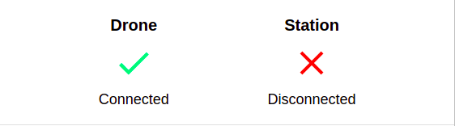
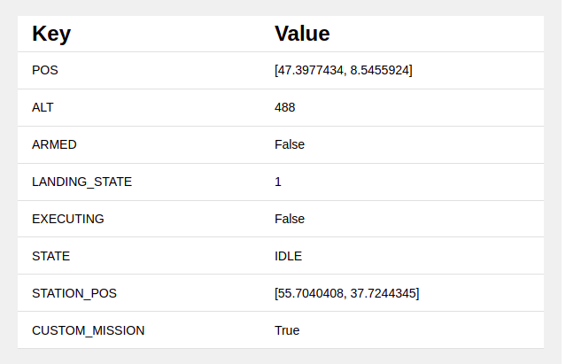
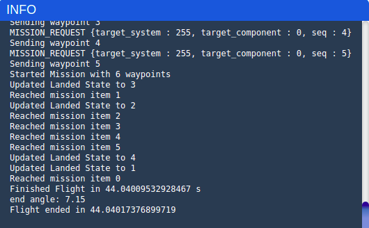

# COEX Station Website

Station Website is software that allows you to communicate with Station and PX4 Copter

## Setup

On your local machine, clone this repo:

```bash
git clone https://github.com/Fullfix/station-test.git
cd station-test
```

Then create **.env** file in *station-test* folder and put the following:

```bash
# Password for running commands
SECRET_CODE=*******
# Drone connection link
DRONE_CONNECTION=udpout:<your_drone_ip>:14550
# Station connection link 
STATION_CONNECTION=udpout:<your_station_ip>:14542
```

Make sure you have [Docker](https://docs.docker.com/get-docker/) and [docker-compose](https://docs.docker.com/compose/install/) installed

Build and run the project

```bash
docker-compose up
```

Visit your website on [http://localhost:3000](http://localhost:3000)

## Usage

Check if your **drone** and **station** are connected



### Custom mission enabled toggle switch:
- **On**: Mission will be uploaded to drone directly from script
- **Off**: Mission must be preuploaded to drone via [QGroundControl](http://qgroundcontrol.com/)

### Testing state (bold text in middle of the page):
- **idle**: Default state, testing hasn't started
- **opening**: Station is opening
- **flying**: Drone is armed, and executing mission
- **locking**: Station is locking mechanism
- **closing**: Station is closing
- **error**: Error state

### Parameters
Test parameters are visible on the left side. They include information about drone, station and testing state



### Console
You can find testing progress in **console**



## Execute test

In order to execute full **station + drone** iteration, click on **Execute Mission** button and enter the password (configurable in **.env** file)
